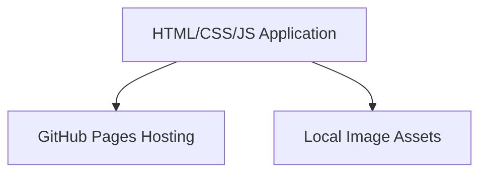

## 1. Architecture Design
纯前端应用，使用静态HTML/CSS/JavaScript，托管在GitHub Pages上

## 2. Technology Description
- Frontend: Vanilla HTML5 + CSS3 + JavaScript (ES2020)
- Styling: Custom CSS with CSS Grid and Flexbox
- Deployment: GitHub Pages via GitHub repository

## 3. Route Definitions
| Route | Purpose |
|-------|---------|
| / | Home page with hero and featured photos |
| /gallery | Photo gallery with filtering |
| /about | Photographer information |

## 4. API Definitions (if backend exists)
N/A - pure frontend application

## 5. Server Architecture Diagram (if backend exists)
N/A - no backend

## 6. Data Model (if applicable)
### 6.1 Data Model Definition
N/A - no database needed

### 6.2 Data Definition Language
N/A - no database needed

### 6.3 Data Storage
- Images stored in `/picture/` directory
- Photo metadata embedded in JavaScript array
