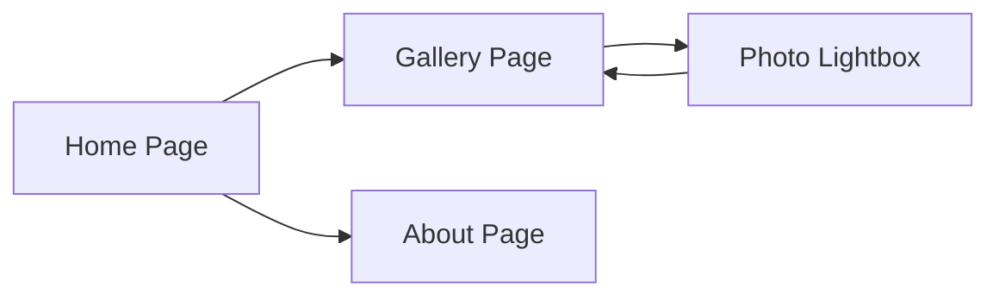

## 1. Product Overview
个人摄影展示网站，展示摄影师作品，提供简约优雅的浏览体验
- 目标用户：摄影爱好者、潜在客户、艺术欣赏者
- 市场价值：建立个人品牌形象，展示专业作品

## 2. Core Features

### 2.1 User Roles (if applicable)
| Role | Registration Method | Core Permissions |
|------|---------------------|------------------|
| Normal User | No registration needed | Browse all gallery content |

### 2.2 Feature Module
1. **Home page**: hero section, navigation, featured photos
2. **Gallery page**: photo grid with category filters
3. **About page**: photographer introduction and contact

### 2.3 Page Details
| Page Name | Module Name | Feature description |
|-----------|-------------|---------------------|
| Home page | Hero section | Large featured photo with smooth parallax effect |
| Home page | Navigation | Minimal navigation bar with smooth scroll |
| Gallery page | Photo grid | Masonry grid layout with lightbox |
| Gallery page | Category filter | Filter photos by category tags |
| About page | Photographer info | Bio, contact information, and social links |

## 3. Core Process
用户访问网站 → 浏览首页英雄区和精选照片 → 点击导航查看作品集 → 使用筛选功能浏览不同类别照片 → 点击照片查看大图 → 查看关于页面了解摄影师

## 4. User Interface Design
### 4.1 Design Style
- Primary color: Deep charcoal (#0f172a)
- Secondary color: Soft warm beige (#f5f0e8)
- Accent color: Subtle gold (#d4af37)
- Button style: Minimal borderless with hover opacity change
- Font: Playfair Display for headings, Inter for body text
- Layout style: Clean, generous whitespace, grid-based
- Icon style: Simple line icons

### 4.2 Page Design Overview
| Page Name | Module Name | UI Elements |
|-----------|-------------|-------------|
| Home page | Hero section | Full-width photo, subtle gradient overlay, centered typography, fade-in animation |
| Gallery page | Photo grid | Masonry layout, smooth hover scaling, lightbox with keyboard navigation |
| About page | Photographer info | Two-column layout on desktop, single column on mobile, clean typography |

### 4.3 Responsiveness
- Mobile-first design, fully adaptive from 320px to 1920px+
- Touch-optimized interactions for mobile devices
- Smooth transitions between breakpoints

### 4.4 3D Scene Guidance (if applicable)
N/A for this project
